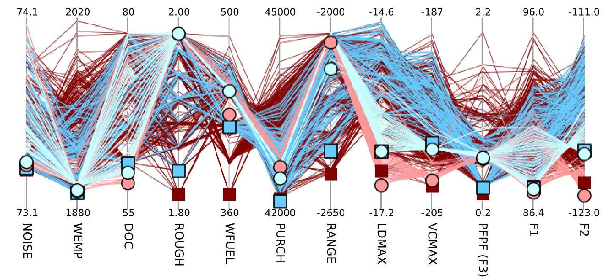

# `parallel.py`

`parallel.py` is a parallel-coordinate plotting routine written in Python.




## Usage Message
```
	usage: parallel.py [-h] [-c COLORS [COLORS ...]] [-C COLUMNS [COLUMNS ...]]
			   [-p PRECISIONS [PRECISIONS ...]]
			   [-a AXIS_NAMES [AXIS_NAMES ...]] [-n NAMES [NAMES ...]]
			   [-H HEADER] [-S] [-V] [-w WRAP] [-m MINIMA [MINIMA ...]]
			   [-M MAXIMA [MAXIMA ...]] [-W LINEWIDTH [LINEWIDTH ...]]
			   [-k MARKER [MARKER ...]] [-z ZORDER [ZORDER ...]]
			   output files [files ...]

	positional arguments:
	  output                base name for the output file
	  files                 files containing sets to plot

	optional arguments:
	  -h, --help            show this help message and exit
	  -c COLORS [COLORS ...], --colors COLORS [COLORS ...]
				add a color to the color cycle
	  -C COLUMNS [COLUMNS ...], --columns COLUMNS [COLUMNS ...]
				columns containing data to plot
	  -p PRECISIONS [PRECISIONS ...], --precisions PRECISIONS [PRECISIONS ...]
				precision for each column
	  -a AXIS_NAMES [AXIS_NAMES ...], --axis-names AXIS_NAMES [AXIS_NAMES ...]
				names for the axes
	  -n NAMES [NAMES ...], --names NAMES [NAMES ...]
				label for the input files
	  -H HEADER, --header HEADER
				number of header lines in input files
	  -S, --split           produce two output files: a PNG for the data, and an
				SVG for the axes
	  -V, --vector          Produce vector output. WARNING: Will produce very
				large output files if the input is too large. More
				than 50 rows of data, and possibly far fewer, is
				asking for trouble. Use -S unless you're absolutely
				sure you want this.
	  -w WRAP, --wrap WRAP  number of axes to draw before wrapping
	  -m MINIMA [MINIMA ...], --minima MINIMA [MINIMA ...]
				minimum values for each column
	  -M MAXIMA [MAXIMA ...], --maxima MAXIMA [MAXIMA ...]
				maximum values for each column
	  -W LINEWIDTH [LINEWIDTH ...], --linewidth LINEWIDTH [LINEWIDTH ...]
				linewidths for solution sets
	  -k MARKER [MARKER ...], --marker MARKER [MARKER ...]
				markers for solution sets
	  -z ZORDER [ZORDER ...], --zorder ZORDER [ZORDER ...]
				zorder offsets for solution sets
```
